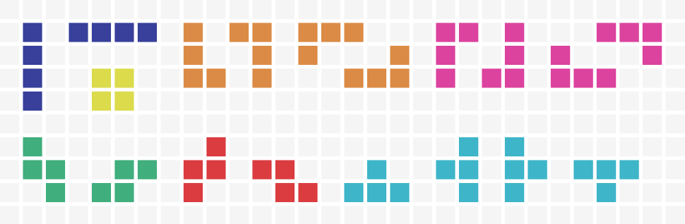

# F - Tututs Tetris

| Time Limit   | 5s    |
|--------------|-------|
| Memory Limit | 64MB  |

## Deskripsi

Tutut sang mantan juara NLC adalah seorang penggila puzzle. Ia memiliki berbagai macam jenis puzzle, dari yang biasa saja hingga yang sangat unik. Salah satu puzzle unik milik Tutut adalah Tetris 3D. Tetris 3D ini mempunyai sebuah kotak dengan ukuran N*M*H dan di setiap dasar kotak dengan koordinat (i, j) terdapat balok dengan ketinggian Hij. Tetris 3D ini juga mempunyai semua kemungkinan balok balok tetris berukuran X. Balok tetris adalah balok yang tersusun dari X kubus yang sisinya saling bersentuhan. Sisi yang bersentuhan bukan sisi atas atau sisi bawah.

Contoh semua kemungkinan balok tetris ukuran 4.

Tutut akan mengambil salah satu balok tetris secara acak, lalu akan meletakkannya pada kotak tetris dari ketinggian yang paling tinggi, lalu turun sedikit demi sedikit hingga ada sisi balok tetris menyentuh balok atau dasar dari kotak tetris.

Sekarang Tutut penasaran, jika ia mengambil salah satu balok tetris secara acak, apakah ada balok tetris yang tidak bisa diletakkan di dalam kotak? Dan berapa sajakah ketinggian minimal yang bisa ditempati tiap-tiap balok tetris di kotak tetris?

Peletakan balok tetris tidak akan mempengaruhi ketinggian pada kotak tetris.

## Format Masukan

Baris pertama adalah bilangan bulat T yaitu jumlah kasus uji.

Baris kedua adalah bilangan bulat N, M, H, yang merupakan ukuran box  serta X yang merupakan ukuran balok tetris.

N baris berikutnya berisi M bilangan bulat Hij  yang merupakan tinggi balok pada kotak tetris.

## Format Keluaran

Baris pertama keluarkan "Kasus #Q:" dengan Q adalah nomor kasus uji.

Baris selanjutnya keluarkan "TIDAK" jika ada setidaknya satu kemungkinan balok tetris yang tidak dapat diletakkan di dalam box, sebaliknya keluarkan "YA".

Baris selanjutnya, jika ada setidaknya satu kemungkinan balok tetris yang tidak dapat diletakkan di dalam box keluarkan sebuah bilangan bulat banyaknya kemungkinan balok tetris yang tidak dapat diletakkan di dalam box.

Sebaliknya keluarkan H baris bilangan bulat, dengan baris ke-i adalah banyaknya kemungkinan balok tetris berukuran X yang memiliki minimum ketinggian di i.

## Contoh Masukan

    2
    3 3 3 2
    1 2 0
    0 2 1
    1 2 0
    2 2 3 2
    3 3
    3 3

## Contoh Keluaran

    Kasus #1:
    YA
    0
    1
    1
    Kasus #2:
    TIDAK
    2

## Batasan

- 1 ≤ T ≤ 20
- 1 ≤ X ≤ 10
- 1 ≤ N ≤ 20
- 1 ≤ M ≤ 20
- 0 ≤ H ≤ 20
- 0 ≤ Hij ≤ H
