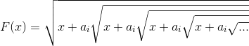

# Problems

- [A - Dadu Joris](#a---dadu-joris)
- [B - Lonely Tutut](#b---lonely-tutut)
- [C - Natrium Hidroksida](#c---natrium-hidroksida)
- [D - Siapa Pasanganku](#d---siapa-pasanganku)
- [E - Bermain Tanah](#e---bermain-tanah)
- [F - Tutut's Tetris](#f---tututs-tetris)

# A - Dadu Joris

| Time Limit   | 1s    |
|--------------|-------|
| Memory Limit | 128MB |

## Deskripsi

Suatu hari, Joris pergi ke SchemaStore untuk membeli oleh oleh untuk Tutut, temannya. Disana banyak sekali barang barang unik. Setelah berjalan-jalan cukup lama, Joris melihat banner :

"DISKON 99,999% DADU EV-PISI, SEHARGA 1000 RUPIAH"

Dadu EV-PISI adalah dadu yang memiliki M - sisi, di masing masing sisi terdapat nilai Ai dimana 1 ≤ Ai ≤ 8. Cara memainkan dadu EV-PISI adalah setiap kali dadu ini dilemparkan pemain akan mendapatkan poin dari :

Dimana ai merupakan nilai dadu yang muncul dan x merupakan hasil dari :

**x = rand() % N**

Fungsi rand mengembalikan nilai antara 1 - 10 trilyun, dimana terdistribusi secara uniform.

Joris pun tertarik dan ingin membeli dadu EV-PISI. Tetapi untuk membeli dadu EV-PISI dengan harga diskon Joris harus mendapatkan Expectation Value dari poin pelemparan dadu tersebut! Joris sedang dilanda kebingungan karena dia tidak bisa memecahkan masalah tersebut. Kemudian Joris ingat bahwa Joris mempunyai teman yaitu Anda, sang programmer profesional, Joris meminta bantuan Anda untuk mendapatkan Expectation Value dari Dadu tersebut!

## Format Masukan

Pada baris pertama terdapat sebuah bilangan T, yang melambangkan banyak kasus uji.

Setiap kasus uji, diawali dengan bilangan M dan N , baris berikutnya terdapat M bilangan yang mewakili nilai Ai yang unik.

## Format Keluaran

Untuk setiap kasus uji, keluarkan *Expectation Value* dari Dadu tersebut, dengan ketelitian 4 angka dibelakang koma.

## Contoh Masukan

    1
    6 10
    1 2 3 4 5 6

## Contoh Keluaran

	4.5147

## Batasan

- 1 ≤ T ≤ 100000
- 4 ≤ M ≤ 8
- 1 ≤ Ai ≤ 8
- 1 ≤ N ≤ 1000000

# B - Lonely Tutut

| Time Limit   | 500ms |
|--------------|-------|
| Memory Limit | 64MB  |

## Deskripsi

Tutut adalah seorang yang disebut “Jenius” dalam Matematika, semua permasalahan Matematika pasti bisa diselesaikannya. Tetapi, tutut merasa kesepian karena tidak ada yang bisa menyelesaikan permasalahannya. Anda sebagai programmer handal, ingin membantu tutut keluar dari rasa kesepian yang sedang dialaminya. Tutut kemudian memberi anda permasalahan sebagai berikut :

Tutut memberi anda 1 persegi dengan panjang L. Setiap detik, setiap persegi dengan panjang L akan terpecah menjadi 4 persegi dengan panjang L/2.

Sekarang Tutut bertanya kepada anda, berapa jumlah panjang dari sisi-sisi persegi yang terbentuk setelah N detik ? Karena hasilnya bisa sangat besar, Tutut hanya menginginkan hasil dengan modulo (10^9+7).

Sebelum itu, Tutut juga sangat suka dengan bilangan Fibonacci, oleh karena itu jika N merupakan bilangan Fibonacci diatas 10, maka keluarkan "YEY" (tanpa tanda petik).

## Format Masukan

Baris pertama berisi bilangan T, yang menyatakan banyaknya kasus uji. T baris berikutnya merupakan bilangan N.

## Format Keluaran

Untuk setiap kasus uji, keluarkan jawaban yang dibutuhkan.

## Contoh Masukan

	3
    1
    5
    13

## Contoh Keluaran

	6
    66
    YEY

## Penjelasan

1 detik : jumlah panjang sisinya adalah 6

5 detik : jumlah panjang sisinya adalah 66

13 detik : karena 13 adalah fibonacci diatas 10, maka keluaran berupa YEY

## Batasan

- L = 1
- 1 ≤ T ≤ 10^5
- 1 ≤ N ≤ 10^8

# C - Natrium Hidroksida

| Time Limit   | 2s    |
|--------------|-------|
| Memory Limit | 64MB  |

## Deskripsi

Navon adalah seorang pelajar di Institut Teknologi Schematics. Ia sangat menyukai pelajaran pemrograman. Pada suatu hari, Navon mendapatakan materi tentang kata palindrom. Kata palindrom adalah suatu kata yang apabila dibaca dari depan maupun belakang akan menghasilkan kata yang sama. Navon pun takjub dengan hal ini dan seketika menyukai kata-kata yang memiliki sifat palindrom.

Setelah itu, ia pun menelusuri internet untuk mencari beberapa kata-kata palindrom. Rekor dunia secara resmi mencatat kata “saippuakivikauppias” yang berasal dari Bahasa Finlandia yang berarti Natrium Hidroksida (NaOH) sebagai kata palindrom terpanjang di dunia dengan panjang 19 huruf. Tidak puas dengan hal itu, Navon pun ingin membuat kata palindrom yang lebih panjang daripada kata tersebut.

Keesokan harinya, Navon membeli seekor anak anjing di sebuah toko hewan. Sayangnya, toko tersebut mempunyai aturan untuk menamai hewan yang dibeli. Aturannya berbunyi :

“Diberikan suatu string S, nama hewan haruslah suatu substring dari S dengan indeks awal A (Indeks dimulai dari 0) dengan panjang substring minimal B.”

Navon pun meminta bantuanmu untuk mencari banyakny kata palindrom yang mungkin untuk nama anjingnya.

## Format Masukan

Baris pertama berisi sebuah string S.

Baris selanjutnya berisi sebuah bilangan Q.

Q baris berikutnya berisi dua buah bilangan A dan B.

## Format Keluaran

Q baris bilangan yang menandakan banyaknya substring yang mungkin sesuai persyaratan pada deskripsi soal.

## Contoh Masukan

	mamam
    3
    0 3
    0 5
    2 5

## Contoh Keluaran

	2
    1
    0

## Batasan

0 ≤ |S|, Q, A, B ≤ 10^5

# D - Siapa Pasanganku

| Time Limit   | 1s    |
|--------------|-------|
| Memory Limit | 64MB  |

## Deskripsi

Hari ini adalah ulang tahun Brembo. Untuk membuat Brembo senang di hari ulang tahunnya, sahabatnya, Dinggo memberikan kejutan berupa hadiah ulang tahun. Tentu, Brembo sangat senang dengan kejutan tersebut, apalagi kejutan tersebut berasal dari sahabatnya sendiri. Setelah dibuka, ternyata hadiah yang Dinggo berikan berupa sekumpulan kartu putih polos tanpa ada tulisan apapun. Brembo pun kebingungan dengan hadiah yang diberikan Dinggo. Lantas, ia segera menemui Dinggo untuk menanyakan maksud dari hadiah yang ia berikan.

Dinggo adalah anak yang cerdas dan penuh kreativitias. Ia tahu bahwa Brembo akan datang menemuinya untuk menanyakan hadiah yang ia berikan. Namun, sebelum itu terjadi, Dinggo telah menyiapkan sebuah tantangan untuk Brembo pecahkan. Sesampainya Brembo di tempat, Dinggo menjelaskan tantangan yang dimaksud.

Pertama, Brembo harus menghitung berapa banyak kartu yang Dinggo berikan kepadanya, lalu meletakkannya di meja yang telah disediakan. Kemudian, dari seluruh kartu tadi, Brembo harus menuliskan sebuah angka (tidak peduli seberapapun) pada setiap kartu dan harus dilakukan dengan urutan tak-turun. Setelah selesai, Dinggo akan menyebutkan sebuah angka. Dari angka yang disebutkan Dinggo, Brembo harus menentukan apakah terdapat sepasang angka (dari kartu) yang jumlahnya tepat dengan angka yang Dinggo sebut.

Brembo sangat kebingungan untuk menjawab tantangan Dinggo. Maka dari itu, ia menelpon Anda sebagai programmer untuk membuatkan sebuah program. Brembo menginginkan agar program itu menerima input berupa bilangan dan menampilkan keluaran berupa satu baris yang berisi kata "ADA" jika memang ada sepasang  angka sesuai tantangan yang dimaksud, "TIDAK ADA" jika sebaliknya.

## Format Masukan

Baris pertama berisi bilangan-bilangan bulat yang masing-masing dipisahkan oleh spasi. Banyaknya bilangan tidak akan lebih dari  batasan dan dijamin urut (urutan tak-turun). Satu baris berikutnya yakni N, bilangan yang diucapkan Dinggo.

## Format Keluaran

Satu baris berisi kata sesuai deskripsi soal. Cetak tanpa tanda petik.

## Contoh Masukan

	1 2 3 4 5 6 7 8 9 10
    5

## Contoh Keluaran

	ADA

## Batasan

- Semua bilangan merupakan bilangan bulat 32-bit.
- Banyaknya bilangan tidak lebih dari 100000 bilangan

# E - Bermain Tanah

| Time Limit   | 2s    |
|--------------|-------|
| Memory Limit | 64MB  |

## Deskripsi

Suatu hari, MusMus, MangMang dan GasGas sedang berpetualang di hutan Schema. Tiba-tiba mereka menemukan N petak tanah dengan ketinggian berbeda yang telah dinomori 1 sampai N. Melihat tanah tersebut, mereka tergoda untuk memainkannya. Permainan dimainkan dengan peraturan:

1.  Jika GasGas berkata '1'dan diikuti dengan 3 bilangan l, r, dan v maka  MusMus dan MangMang  akan menambah tanah setinggi v meter pada rentang l sampai r (inklusif). Jika v negatif, maka mereka menggali tumpukan tanah sebanyak v meter.
2. Jika GasGas berkata '2' diikuti 2 bilangan l dan r, maka MusMus harus memosisikan di petak tertinggi dan MangMang harus memosisikan di petak terendah antara petak l dan r (inklusif). Setelah itu, GasGas akan menghitung dan mencatat berapa selisih ketinggian dari petak yang ditempati MusMus dan petak yang ditempati MangMang. Karena GasGas malas, maka ia meminta bantuanmu untuk membuat program untuk mensimulasikan permainan tersebut.

## Format Masukan

Baris pertama berisi sebuah bilangan N yang merupakan banyak petak tanah yang ada.
Baris berikutnya berisi N bilangan Ai yang ketinggian dari petak tanah tersebut.
Baris berikutnya berisi sebuah bilangan Q yang merupakan banyak instruksi yang akan diberikan.
Q baris berikutnya berisi instruksi-instruksi dengan ketentuan sebagai berikut:
    1 l r v     yaitu menambahkan tanah setinggi v meter ke masing-masing petak tanah dalam rentang l sampai r (inklusif)
    2 l r        yaitu mencari selisih ketinggian terbesar petak tanah dalam rentang l sampai r (inklusif)

## Format Keluaran

Untuk setiap perintah dengan bilangan pertama  '2', cetak selisih terbesarnya.

## Contoh Masukan

    5
    1 2 3 4 5
    5
    2 1 5
    1 4 5 10
    2 1 5
    1 1 2 -10
    2 1 5

## Contoh Keluaran

    4
    14
    24

## Batasan

- 1 ≤ Q ≤ 10^5
- 1 ≤ N ≤ 10^5
- 1 ≤ l ≤ r ≤ N
- -2^32 ≤ v, Ai ≤ 2^32

# F - Tututs Tetris

| Time Limit   | 5s    |
|--------------|-------|
| Memory Limit | 64MB  |

## Deskripsi

Tutut sang mantan juara NLC adalah seorang penggila puzzle. Ia memiliki berbagai macam jenis puzzle, dari yang biasa saja hingga yang sangat unik. Salah satu puzzle unik milik Tutut adalah Tetris 3D. Tetris 3D ini mempunyai sebuah kotak dengan ukuran N*M*H dan di setiap dasar kotak dengan koordinat (i, j) terdapat balok dengan ketinggian Hij. Tetris 3D ini juga mempunyai semua kemungkinan balok balok tetris berukuran X. Balok tetris adalah balok yang tersusun dari X kubus yang sisinya saling bersentuhan. Sisi yang bersentuhan bukan sisi atas atau sisi bawah.

Contoh semua kemungkinan balok tetris ukuran 4.

Tutut akan mengambil salah satu balok tetris secara acak, lalu akan meletakkannya pada kotak tetris dari ketinggian yang paling tinggi, lalu turun sedikit demi sedikit hingga ada sisi balok tetris menyentuh balok atau dasar dari kotak tetris.

Sekarang Tutut penasaran, jika ia mengambil salah satu balok tetris secara acak, apakah ada balok tetris yang tidak bisa diletakkan di dalam kotak? Dan berapa sajakah ketinggian minimal yang bisa ditempati tiap-tiap balok tetris di kotak tetris?

Peletakan balok tetris tidak akan mempengaruhi ketinggian pada kotak tetris.

## Format Masukan

Baris pertama adalah bilangan bulat T yaitu jumlah kasus uji.

Baris kedua adalah bilangan bulat N, M, H, yang merupakan ukuran box  serta X yang merupakan ukuran balok tetris.

N baris berikutnya berisi M bilangan bulat Hij  yang merupakan tinggi balok pada kotak tetris.

## Format Keluaran

Baris pertama keluarkan "Kasus #Q:" dengan Q adalah nomor kasus uji.

Baris selanjutnya keluarkan "TIDAK" jika ada setidaknya satu kemungkinan balok tetris yang tidak dapat diletakkan di dalam box, sebaliknya keluarkan "YA".

Baris selanjutnya, jika ada setidaknya satu kemungkinan balok tetris yang tidak dapat diletakkan di dalam box keluarkan sebuah bilangan bulat banyaknya kemungkinan balok tetris yang tidak dapat diletakkan di dalam box.

Sebaliknya keluarkan H baris bilangan bulat, dengan baris ke-i adalah banyaknya kemungkinan balok tetris berukuran X yang memiliki minimum ketinggian di i.

## Contoh Masukan

    2
    3 3 3 2
    1 2 0
    0 2 1
    1 2 0
    2 2 3 2
    3 3
    3 3

## Contoh Keluaran

    Kasus #1:
    YA
    0
    1
    1
    Kasus #2:
    TIDAK
    2

## Batasan

- 1 ≤ T ≤ 20
- 1 ≤ X ≤ 10
- 1 ≤ N ≤ 20
- 1 ≤ M ≤ 20
- 0 ≤ H ≤ 20
- 0 ≤ Hij ≤ H
