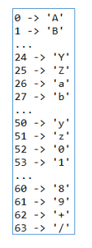
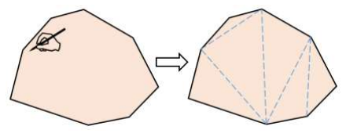
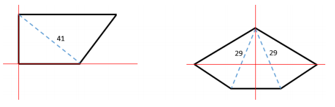
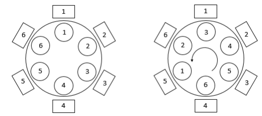
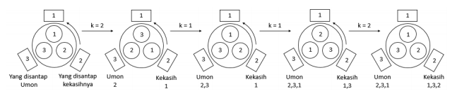

# Problems

- [A - ENCODING](#a---encoding)
- [B - Half-Life 3 Confirmed](#b---half-life-3-confirmed)
- [C - Ledakan Terbesar](#c---ledakan-terbesar)
- [D - Lift Menyebalkan](#d---lift-menyebalkan)
- [E - Meja Putar](#e---meja-putar)
- [F - Sensus Rekayasa](#f---sensus-rekayasa)
- [G - Strategi Tentara](#g---strategi-tentara)
- [H - Traktiran Perpisahan](#h---traktiran-perpisahan)

# A - ENCODING

| Time Limit   | 3s    |
|--------------|-------|
| Memory Limit | 512MB |

## Deskripsi

Pak Chandra sedang suka dengan encoding, kali ini dia menemukan suatu jenis encoding yang mengubah binary menjadi karakter. Jenis encoding ini mengambil 6 bit binary, kemudian mengubah nya menjadi bilangan desimal. Setelah itu bilangan desimal ini akan di ubah menjadi huruf dengan ketentuan sebagai berikut :

Gambar diatas menjelaskan bahwa angka 0 akan diubah menjadi 'A', angka 1 akan diubah menjadi 'B' dst. Pak Chandra meminta bantuan Anda sebagai programmer handal untuk membuat program yang menerima sekumpulan angka binary kemudian menampilkan hasil encodingnya.

## Format Masukan

Baris pertama berisi sebuah integer T, banyaknya kasus uji untuk soal ini. T baris berikutnya berisi sekumpulan binary S dengan banyak bit <= 150. Banyak bit dijamin habis dibagi 6.

## Format Keluaran

Untuk setiap kasus uji, keluarkan hasil encoding dari tiap input dengan format berikut.
Case #c: Y
dimana c adalah nomor urut kasus (dimulai dari 1), dan Y merupakan hasil encoding dari S.

## Contoh Masukan

	3
	010101000110100001100101
	011101000110100001100101001000000111
	000101110101011010010110001101101011

## Contoh Keluaran

	Case #1: VGhl
	Case #2: dGhlIH
	Case #3: F1aWNr

## Penjelasan

Kasus 1 :
S dipecah setiap 6 karakter menjadi 010101, 000110, 100001, 100101 Tiap pecahan diubah menjadi angka desimal, yaitu 21, 6, 33, dan 37 Kemudian ubah menjadi karakter sesuai pemetaan di deskripsi soal, 21 -> 'V', 6 -> 'G', 33 -> 'h', 37 -> 'l' Didapatkan hasil 'VGhl'.

## Batasan

- T <= 50
- Panjang 6 <= S <= 150
- S hanya akan terdiri dari karakter '0' dan '1

# B - Half-Life 3 Confirmed

| Time Limit   | 3s    |
|--------------|-------|
| Memory Limit | 512MB |

## Deskripsi

Pak Umon gemar bermain Half-Life dan Half-Life 2. Namun, ia terlebih gemar bermain dengan poligon kesayangannya. Poligon tersebut berbentuk konveks (cembung) dan memiliki N sisi. Belakangan ini, ia mendengar gosip bahwa akan dirilis Half-Life 3. Pak Umon ingin merayakannya bersama dengan poligon kesayangannya dengan menggambar pola segitiga pada poligon tersebut. Pak Umon mengambil spidol dan melukis beberapa garis yang menghubungkan
titik-titik sudut dari poligon tersebut. Hasilnya adalah sebagai berikut.

Garis-garis yang dilukis tidak boleh saling berpotongan. Perhatikan bahwa untuk poligon dengan N sisi, harus tepat dibagi menjadi (N-2) segitiga.

Untuk garis sepanjang r, Pak Umon memerlukan waktu sebanyak r2 untuk melukisnya. Waktu total yang diperlukan untuk melukisi seluruh poligon tersebut jelas merupakan akumulasi dari waktu untuk melukis setiap garis yang diperlukan. Namun, Pak Umon ingin segera memainkan Half-Life 3 sehingga ia tak punya banyak waktu. Bantulah Pak Umon untuk menghitung waktu tersingkat yang ia perlukan untuk melukisi poligon kesayangannya.

## Format Masukan

Soal ini terdiri atas T kasus. T diberikan di baris pertama berkas masukan.

Setiap kasus diawali dengan baris berisi sebuah integer N.
N baris berikutnya merupakan pasangan integer (xi, yi) yang merupakan koordinat poligon Pak Umon.

## Format Keluaran

Untuk setiap kasus, keluarkan sebaris output dengan format berikut.
Case #c: ans
c merupakan nomor kasus (dimulai dari 1), dan ans merupakan sebuah integer yang nilainya
merupakan waktu tersingkat seperti yang diminta soal.

## Contoh Masukan

	2
	4
	0 0
	0 4
	8 4
	5 0
	5
	-2 -2
	-5 0
	0 3
	5 0
	2 -2

## Contoh Keluaran

	Case #1: 41
	Case #2: 58

## Penjelasan

Berikut garis yang dilukis Pak Umon untuk kedua contoh kasus uji.

## Batasan

- 1 <= T <= 100
- 4 <= N <= 100
- -1000 <= xi, yi <= 1000
- Dijamin titik-titik diberikan secara searah jarum jam dan membentuk sebuah poligon konveks.
- Dijamin tidak ada tiga titik yang segaris.

# C - Ledakan Terbesar

| Time Limit   | 3s    |
|--------------|-------|
| Memory Limit | 512MB |

## Deskripsi

Sedang terjadi perang antara Negara Api dan Negara Bumi, Negara Api menyerang Negara Bumi dengan bola-bola api sehingga Negara Bumi mengalami kerusakan dimana-mana. Serangan bola api tersebut menyebabkan bekas ledakan di tanah Negara Bumi. Jendral dari Negara Bumi ingin mengetahui kerusakan terbesar yang disebabkan oleh bola-bola api tersebut. Anda diberikan peta kerusakan Negara Bumi, dengan format sebagai berikut.

- Karakter '*' menunjukkan daerah yang rusak
- Karakter '.' menunjukkan daerah yang tidak rusak

Daerah yang dihitung termasuk dalam 1 kerusakan yaitu daerah yang bersebelahan (atas, kiri, kanan, bawah). Peta yang diberikan memiliki ukuran R * C. Tentukan kerusakan terbesar yang
dialami oleh Negara Bumi.

## Format Masukan

Baris pertama berisi sebuah integer T, banyaknya kasus uji untuk soal ini.
Untuk tiap kasus uji akan diawali dengan 2 bilangan R dan C.
Kemudian di ikuti R baris input, yang masing-masing terdiri dari C karakter

## Format Keluaran

Untuk setiap kasus uji, keluarkan kerusakan terbesar dengan format berikut.
Case #c: Y
dimana c adalah nomor urut kasus (dimulai dari 1), dan Y merupakan kerusakaan terbesar yang
terjadi di Negara Bumi.

## Contoh Masukan

	2
	5 4
	.*..
	.**.
	....
	..*.
	*...
	4 7
	.*..*..
	***..*.
	*.*..*.
	....*.*

## (Salah Satu Cara) Contoh Keluaran

	Case #1: 3
	Case #2: 6

## Penjelasan

Kasus 1: Ledakan terbesar yang ada terdapat pada baris pertama dan kedua
	.*..
	.**.
dimana terdapat 3 daerah rusak yang saling terhubung.

## Batasan

- T <= 50
- 1 <= R, C <= 50
- Hanya terdapat karakter '*' dan '.' pada peta.

# D - Lift Menyebalkan

| Time Limit   | 3s    |
|--------------|-------|
| Memory Limit | 512MB |

## Deskripsi

Pada suatu hari, Anda sedang berada disebuah gedung untuk meeting dengan client Anda. Anda berada di lantai X, pada gedung yang memiliki N lantai, dan client Anda berada pada lantai Y.
Terdapat sebuah lift pada gedung tersebut, namun lift tersebut hanya bisa menuju A lantai di atasnya dan B lantai dibawahnya. Jika lantai tersebut tidak ada, maka lift itu tidak akan bekerja.
Cari tahu berapa kali minimal Anda harus menggunakan lift untuk sampai ke lantai Y, namun jika lantai Y tidak dapat dicapai dengan lift, tuliskan "Pakai tangga saja".

## Format Masukan

Baris pertama berisi sebuah integer T, banyaknya kasus uji untuk soal ini.

T baris berikutnya berisi lima buah bilangan N, X, Y, A, B.

## Format Keluaran

Untuk setiap kasus uji, keluarkan berapa kali minimal Anda harus menggunakan lift untuk sampai
ke lantai Y, dengan format berikut.
	Case #c: Z
dimana c adalah nomor urut kasus (dimulai dari 1), dan Z merupakan minimal penggunaan lift,
atau tulisan "Pakai tangga saja" tanpa tanda petik, jika lantai Y tidak bisa dicapai dengan lift.

## Contoh Masukan

	3
	10 1 10 3 1
	20 3 17 5 2
	30 6 27 4 2

## Contoh Keluaran

	Case #1: 3
	Case #2: 7
	Case #3: Pakai tangga saja

## Penjelasan

Kasus 1:
Gedung terdiri dari 10 lantai, Anda sedang berada di lantai 1 dan ingin ke lantai 10. Lift hanya
bisa naik 3 lantai, atau turun 1 lantai.
Untuk kasus ini minimal penggunaan lift adalah 3 kali yaitu:
dari lantai 1 ke 4
dari lantai 4 ke 7
dari lantai 7 ke 10

## Batasan

- T <= 500
- 1 <= X, Y <= N <= 106, X != Y
- 1 <= A, B <= 106

# E - Meja Putar

| Time Limit   | 3s    |
|--------------|-------|
| Memory Limit | 512MB |

## Deskripsi

Di sebuah pesta, makanan dihidangkan di atas meja putar yang besar. Karena ini adalah meja putar, maka ketika hidangan yang kita inginkan terletak terlalu jauh, kita dapat memutar meja
agar hidangan tersebut sampai tepat di depan kita.

Malam ini, disajikan tepat N hidangan berbeda untuk N orang tamu. Awalnya, tamu 1 menghadap hidangan 1, tamu 2 menghadap hidangan 2, dan seterusnya hingga tamu N menghadap hidangan N. Apabila meja diputar k posisi ke kiri, Maka tamu 1 jadi menghadap hidangan ke 1+k MOD N, tamu 2 menghadap hidangan ke 2+k MOD N, hingga tamu ke N menghadap hidangan ke k. Lihat skema berikut untuk memperjelas.

Meja untuk N=6 tamu, diputar sebanyak k=2 ke kiri.

Mengikuti tradisi, sebelum makan setiap tamu dibagikan secarik kertas yang memuat daftar hidangan dalam urutan acak. Urutan tersebut berbeda dari tamu ke tamu. Setiap tamu diwajibkan menyantap hidangan berdasarkan daftar tersebut. Awalnya, tamu akan menyantap hidangan teratas pada daftar. Setelah itu, ia akan mencoret entri tersebut dan menyantap hidangan teratas berikutnya pada daftar, begitu terus hingga semua hidangan tersantap.

Jelas bahwa tamu hanya boleh mengambil hidangan yang tepat berada di hadapannya, dan hanya saat meja berhenti berputar. Apabila hidangan yang saat ini berada di hadapan suatu tamu adalah yang teratas pada daftar, tamu akan menyantap hidangan itu. Namun apabila bukan, tamu tersebut akan diam saja.

Pak Umon datang dengan kekasihnya dan mereka memutuskan untuk menghabiskan makanan secepat mungkin supaya mereka bisa cepat turun ke lantai dansa. Anda sebagai juru putar, dipercaya Pak Umon untuk melakukan misi ini. Tentukan minimal berapa kali meja harus diputar, agar Pak Umon dan kekasihnya dapat menyelesaikan makan malamnya. Meja dapat diputar ke posisi manapun dalam 1 kali putaran.

## Format Masukan

Baris pertama berisi bebuah integer T, yaitu banyaknya kasus uji.
Untuk setiap kasus uji:
Baris pertama berisi tiga integer N, pU, dan pK, yaitu banyaknya tamu, posisi tempat duduk Pak Umon, dan posisi tempat duduk kekasihnya.
Baris kedua berisi N integer, yaitu urutan hidangan yang harus disantap Pak Umon.
Baris ketiga berisi N integer, yaitu urutan hidangan yang harus disantap kekasih Pak Umon

## Format Keluaran

Untuk setiap kasus uji, keluarkan sebaris berformat berikut.
	Case #c: ans
c adalah nomor kasus uji (dimulai dari 1), dan ans adalah sebuah integer yang menyatakan jumlah
minimal meja harus diputar

## Contoh Masukan

	3
	6 1 3
	1 2 3 4 5 6
	3 4 5 6 1 2
	6 3 5
	1 2 3 4 5 6
	3 4 5 6 1 2
	3 3 2
	2 3 1
	1 3 2

## Contoh Keluaran

	Case #1: 5
	Case #2: 6
	Case #3: 4

## Penjelasan

Untuk kasus pertama, Pak Umon dan kekasihnya dapat langung menyantap hidangan pertama tanpa meja diputar. Hidangan-hidangan selanjutnya dapat diakses dengan memutar meja 1
posisi, sebanyak 5 kali.

Untuk kasus kedua, ini mirip dengan kasus pertama, tetapi untuk menyantap hidangan pertama meja harus diputar dahulu.

Kasus ketiga dijelaskan dengan gambar berikut

## Batasan

- 1 <= T <= 30
- Untuk 90% kasus, 2 <= N <= 103.
- Untuk 10% kasus, 2 <= N <= 105.
- 1 <= pU, pK <= N; pU != pK
- Urutan hidangan pasti memuat integer 1 hingga N dalam suatu permutasi tertentu.

# F - Sensus Rekayasa

| Time Limit   | 3s    |
|--------------|-------|
| Memory Limit | 512MB |

## Deskripsi

Kemarin, Pak Umon ditugaskan untuk melakukan sensus penduduk tahunan di kompleks rumahnya. Bentuk kompleks ini memanjang, sehingga rumah diberikan nomor terurut mulai dari
1 hingga N dari Barat ke Timur. Pak Umon mendata setiap rumah, dan menulis nama setiap penduduk ke dalam suatu daftar yang panjang. Namun, ketika menyerahkan daftar yang berisi M nama tersebut ke bosnya, Pak bos bingung karena daftar tersebut hanya berisi nama-nama penduduk saja. Padahal ia juga memerlukan data mengenai penduduk mana yang tinggal di rumah yang mana.

Pak Umon mencoba untuk mengingat-ingat kejadian kemarin. Ia ingat bahwa ia mulai dari rumah nomor 1, dan selalu terus bergerak ke rumah bernomor N. Karena nama-nama yang ditulisnya dalam daftar juga selalu berurut ke bawah, maka nama yang terletak lebih ke bawah pada daftar tidak mungkin memiliki nomor rumah yang lebih kecil dibandingkan dengan nama yang terletak lebih atas. Ia juga ingat bahwa tidak ada rumah yang tidak berpenghuni. Selain itu, Pak Umon juga memiliki K kenalan yang ia hapal nomor rumahnya.

Berdasarkan data-data tersebut, Pak Umon mencoba untuk mengarang laporan mengenai penduduk mana yang tinggal di rumah yang mana. Namun, ia ingin terlebih dahulu menghitung ada berapa konfigurasi berbeda yang mungkin untuk hal tersebut. Dua konfigurasi dikatakan
berbeda apabila dalam dua konfigurasi tersebut terdapat suatu rumah yang jumlah penghuninya
berbeda.

## Format Masukan

Baris pertama berisi sebuah integer T, banyaknya kasus uji untuk soal ini. Untuk setiap kasus uji, baris pertama berisi 3 integer M N K (banyaknya penduduk, banyaknya rumah, dan banyaknya kenalan Pak Umon). K baris berikutnya berisi sepasang integer Pi Ri. Artinya, penduduk ke-i pada daftar memiliki
nomor rumah Ri.

## Format Keluaran

Untuk setiap kasus uji, keluarkan sebaris berisi 2 integer dengan format berikut.
	Case #c: ans
Dengan c adalah nomor kasus uji (dimulai dari 1), dan ans adalah banyaknya konfigurasi berbeda seperti yang dijelaskan soal, dimodulus 1000000007 (109 + 7). Apabila tidak terdapat satupun konfigurasi yang mungkin, maka nilai ans = 0.

## Contoh Masukan

	5
	4 3 2
	1 1
	4 3
	5 2 4
	1 1
	2 1
	3 2
	5 2
	5 3 3
	1 1
	2 2
	4 1
	10 4 2
	5 1
	7 4
	5 3 3
	1 1
	3 2
	5 3

## Contoh Keluaran

	Case #1: 3
	Case #2: 1
	Case #3: 0
	Case #4: 0
	Case #5: 4

## Penjelasan

Pada kasus pertama, diketahui bahwa penduduk 1 berada di rumah 1, dan penduduk 4 di rumah 3. Dengan demikian, maka konfigurasinya adalah sebagai berikut.

	1 ? ? 3
Ketiga konfigurasi yang memungkinkan adalah
	1 1 2 3
	1 2 2 3
	1 2 3 3
Perhatikan bahwa konfigurasi berikut tidak memungkinkan.
	1 1 3 3 (rumah 2 tidak berpenghuni)
	1 2 1 3 (nomor rumah tidak terurut naik)
Pada kasus kedua, satu-satunya konfigurasi yang mungkin adalah 1 1 2 2 2.

## Batasan

- 1 <= T <= 100
- 1 <= M <= 5000
- 1 <= N <= 5000
- 0 <= K <= M
- 1 <= Pi <= M
- 1 <= Ri <= N
- Untuk setiap i < j, Pi < Pj (semua penduduk yang nomor rumahnya Pak Umon hapal, akan diberikan secara menaik (ascending)).

# G - Strategi Tentara

| Time Limit   | 3s    |
|--------------|-------|
| Memory Limit | 512MB |

## Deskripsi

Jenderal Umon ingin menyiapkan strategi perang untuk memerangi negara tetangga. Oleh sebab itu beliau ingin menyiapkan perlengkapan untuk N orang tentaranya. Untuk dapat melakukan itu, Jenderal harus menentukan jumlah kapten dan serdadu. Di negara Pak Umon, tentara disebut kapten apabila ia memiliki tentara lain dibawahnya (baik itu serdadu maupun kapten yang lain), sedangkan serdadu tidak memiliki anak buah.

Seorang kapten dapat memiliki maksimal M bawahan langsung. Bawahan langsung adalah tentara yang berada persis satu tingkat di bawah atasannya. Maka, bawahan dari bawahan langsung bukanlah bawahan langsung. Seorang kapten dengan kurang dari M bawahan langsung tidak dapat bekerja dengan baik, sehingga Pak Umon hanya mentolerir maksimal terdapat 1 kapten dengan kurang dari M bawahan langsung.

Salah satu ujian untuk menjadi kapten adalah menghitung ada berapa maksimal kapten yang dapat diangkat oleh Pak Umon, berdasarkan ketentuan di atas.

## Format Masukan

Baris pertama berisi sebuah integer T, yaitu banyaknya kasus uji untuk soal ini. Setiap kasus uji berisi dua integer N M (banyaknya tentara, dan banyaknya bawahan langsung seorang kapten). 

## Format Keluaran

Untuk setiap kasus uji, keluarkan sebaris string dengan format berikut.
	Case #x: y z
dimana x merepresentasikan nomor kasus, y adalah jumlah maksimal kapten dan z merupakan jumlah serdadu.

## Contoh Masukan

	3
	10 5
	3 2
	5 3

## Contoh Keluaran

	Case #1: 2 8
	Case #2: 1 2
	Case #3: 2 3

## Penjelasan

untuk kasus 1 :

## Batasan

- 1 <= T <= 1000
- 1 <= N,M <= 1000000

# H - Traktiran Perpisahan

| Time Limit   | 3s    |
|--------------|-------|
| Memory Limit | 512MB |

## Deskripsi

Pak Emon sedang sedih, pasalnya beliau sebentar lagi harus pergi meninggalkan murid muridnya. Pak Emon ingin mentraktir anak-anak muridnya, beliau sudah tahu bahwa biaya yang dibutuhkan adalah p. Sekarang beliau hanya memiliki deposit senilai d dengan bunga per
bulannya sebesar i persen.

Pak Emon meminta bantuan anda untuk menghitung berapa bulan yang dibutuhkan agar nominal depositnya lebih besar sama dengan dana yang dibutuhkan untuk mentraktir anak-anaknya. Ayo bantulah Pak Emon mempersiapkan pesta perpisahannya

## Format Masukan

Program akan menerima sebuah bilangan bulat t yang mendefinisikan banyaknya kasus yang akan diberikan kepada program.
Untuk T baris berikutnya akan terdapat 3 bilangan bulat d p i untuk setiap barisnya.

## Format Keluaran

Untuk setiap kasus uji, keluarkan sebaris string dengan format berikut.
	Case #x: y
dimana x merepresentasikan nomor kasus, y adalah jumlah bulan yang dibutuhkan.

## Contoh Masukan

	4
	1000 2000 20
	1000 2000 10
	1000 2000 50
	3000 1000 40

## Contoh Keluaran

	Case #1: 4
	Case #2: 8
	Case #3: 2
	Case #4: 0

## Penjelasan

untuk kasus 1 :

(bulan 1)
deposito = 1000
bunga = 200
total = 1200

(bulan 2)
deposito = 1200
bunga = 240
total = 1440

(bulan 3)
deposito = 1440
bunga = 288
total = 1728

(bulan 4)
deposito = 1728
bunga = 346.5
total = 2074.5

total melebihi target profit maka jawabnya 4.

untuk kasus 4 :

Pak Emon tidak perlu melakukan deposit karena nilai uang yang dimilikinya sudah mampu menutupi acara makan makan yang akan diadakan beliau.

## Batasan

1 <= t <= 105
1 <= p <= 108
1 <= d <= 108
1 <= i <= 100
