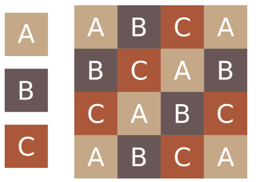

# Problems

- [A - Goats Competition](#a---goats-competition)
- [B - Family Reunion](#b---family-reunion)
- [C - Batik Cap](#c---batik-cap)
- [D - Friends](#d---friends)
- [E - JogJek](#e---jogjek)
- [F - Kill The Goats](#f---kill-the-goats)
- [G - Wireless Internet Connection](#g---wireless-internet-connection)

# A - Goats Competition

| Time Limit   | 1s   |
|--------------|------|
| Memory Limit | 64MB |

## Description

Mr. Blangkon and his goats are following Goats Competition in Yogyakarta. The competition is simple, a goat will go up to the stage one by one, and the judges will give scores based on its cuteness, smell, attitude, and other criterias. The winner is a goat with the highest score among the others. Mr. Blangkon compete does not only wants to win the competition but he also wants to set a new record as the highest score of all time.

You will be given four total scores from contestants and an integer R the current highest score. Print "new record!" if the winner set a new record (the winner total score greater than the current highest score), and "no new record" otherwise.

## Input Format

The first line of input contains an integer T, denoting the number of cases. Each case consists of a line contains of five Integers: G1, G2, G3, G4, and R. G1, G2, G3, and G4 denote the score of all four contestants.

## Output Format

For each case, output in a line "Case #X: Y", where X is the case number, starts from 1, and Y is a string as explained above.

## Sample Input

	2
	73 62 81 74 75
	73 62 81 74 82

## Sample Output

	Case #1: new record!
	Case #2: no new record

## Constraint

- 1 ≤ T ≤ 100
- 1 ≤ G1, G2, G3, G4, R. ≤ 100

# B - Family Reunion

| Time Limit   | 1s   |
|--------------|------|
| Memory Limit | 64MB |

## Description

One day, Mr.Blangkon attended his family reunion. There are N people who attend that reunion, including Mr.Blangkon. Suddenly a mysterious person approached Mr.Blangkon. Then the following conversation occurs:

Mysterious Person: "Hey Blangkon! long time no see. Remember me?"
Blangkon: *Surprised* "Oh hey! I'm sorry, who are you?"
Mysterious Person: "Oh! What's wrong with you? It's me, Tejo. We have the same grandfather."
Blangkon: "Tejo? Ah, long time no see. You look fatter, though.."
After finishing his conversation with Tejo, Mr.Blangkon thinks, "Hmm, I even forgot my own cousin. What should I do?"

Fortunately, Mr.Blangkon have a list of the people who attend the reunion, along with the father's name of each person (All members of Blangkon's family attended the reunion).

Mr.Blangkon thinks if he is called by someone, how could he determine the relationship between that person and himself? Please help Mr.Blangkon!

## Input Format

The first line of input contains two integer N and T, denoting the number of people who attended the reunion and the number of people who called Mr.Blangkon, respectively.

The next N-1 lines, each consists of two string A and B. A denotes the name of a person and B denotes the name of that person's father.

The next T lines, each consists of a string C, denoting the name of a person who called Mr.Blangkon.

## Output Format

For each person C who called Mr.Blangkon, assume that the Lowest Common Ancestor between Mr.Blangkon and C is Y, then:

In the first line, output "Case #X:", where X is the case number starts from 1;
In the second line, output the lineage from Y to Mr.Blangkon;
In the third line, output the lineage from Y to C.
There should be a line break between two consecutive cases. See sample cases for the output format.

## Sample Input 1

	5 1
	Ahmad Abdul
	Adi Abdul
	Tejo Ahmad
	Blangkon Adi
	Tejo

## Sample Output 1
 
	Case #1:
	Abdul->Adi->Blangkon
	Abdul->Ahmad->Tejo

## Sample Input 2

	2 1
	Blangkon Adi
	Adi

## Sample Output 2
 
	Case #1:
	Adi->Blangkon
	Adi

## Sample Input 3

	7 2
	Ahmad Abdul
	Adi Abdul
	Asep Abdul
	Tejo Ahmad
	Surti Adi
	Blangkon Adi
	Surti
	Tejo

## Sample Output 3
 
	Case #1:
	Adi->Blangkon
	Adi->Surti

	Case #2:
	Abdul->Adi->Blangkon
	Abdul->Ahmad->Tejo

## Constraint

- 1 < N ≤ 1000
- 1 ≤ T < N
- 1 ≤ |A|, |B| ≤ 20
- The name of person who attends the reunion is a string that consists of alphabets only (A-Z, a-z), and all names are unique to each other.
- There is only one person who doesn't have a father.
- It is guaranteed that the list of names contains the name of Mr.Blangkon and the person who called him.

# C - Batik Cap

| Time Limit   | 1s   |
|--------------|------|
| Memory Limit | 64MB |

## Description

Batik Cap is one of the famous technique to produce Indonesian traditional cloth, Batik. In production, it created by stamping the cloth using some copper stamp-like tools called Cap. A Batik Cap cloth consist of small Batik patterns stamped with some rules.

Mr. Blangkon, Head of small Batik Cap Company, asks you to create a program that shows the preview of the Batik Cap cloth before it is produced. You will be given P small Batik patterns (each has size M width x N length), then draw the full-pattern of Batik Cap cloth (that has size R width x C length) after stamped with the P small patterns.

For example, you are given P=3 small Batik patterns A, B, and C (see the figure above). Those small patterns will be stamped on the cloth using the following rules:

1. Stamp the pattern start from the top-left part of the cloth. Stamp without rotating neither the Cap nor the cloth.
2. Stamp downward (on first column) with following the pattern order: A, B, C, A, B, C, and so on
3. After you reach the bottom of the cloth, then you start again from the top of the next column (second column)
4. Every time you move to the next column, the next pattern order is shifted once so in the second column it become: B, C, A, B, C, A, and so on.
5. Stamp downward, until reach the bottom of the cloth.
6. Repeat step number 3 to 5 until all cloth fully-stamped

## Input Format

The first line of the input is an integer T denoting the number of cases. Each case start with a line contains of five integers: P, M, N, R, and C as explained in the problem description above, then followed with P small patterns that has size M x N.

## Output Format

For each case output "Case #X:" on the first line, where X is the case number starts from 1, Then followed with R x C string the result of Batik Cap cloth.

## Sample Input 1

	1
	3 2 2 8 8
	..
	..
	||
	||
	//
	//

## Sample Output 1

	Case #1:
	..||//..
	..||//..
	||//..||
	||//..||
	//..||//
	//..||//
	..||//..
	..||//..

## Sample Input 2

	1
	3 2 2 6 8
	..
	..
	||
	||
	//
	//

## Sample Output 2

	Case #1:
	..||//..
	..||//..
	||//..||
	||//..||
	//..||//
	//..||//

## Constraint

- 1 ≤ T ≤ 20
- 1 ≤ P ≤ 5
- 1 ≤ M, N ≤ 5
- 1 ≤ R, C ≤ 50
- R mod M = 0 and C mod N = 0
- Patterns may contains any character except whitespace

# D - Friends

| Time Limit   | 1s   |
|--------------|------|
| Memory Limit | 64MB |

## Description

Mr. Blangkon has N friends. Each of them invites him to a meeting at a certain time. Even though Mr. Blangkon is invited, he has to pay for accommodation. Because of the importance of the meeting, Mr. Blangkon can't go to two or more meetings in same day.

For example, Mr. Blangkon has 4 friends, Semar, Gareng, Petruk, and Bagong.

- Semar invites Mr. Blangkon at day 1 until day 3 (inclusive), and Mr. Blangkon has to pay 3 dollars.
- Gareng invites Mr. Blangkon at day 2 until day 5 (inclusive), and Mr. Blangkon has to pay 1 dollars.
- Petruk invites Mr. Blangkon at day 4 until day 7 (inclusive), and Mr. Blangkon has to pay 3 dollars.
- Bagong invites Mr. Blangkon at day 3 until day 5 (inclusive), and Mr. Blangkon has to pay 2 dollars.

Mr. Blangkon wants to come to all meetings that don't overlap each other, and now he has M dollars. Assume that if he comes to a meeting, he will join the meeting from the first day until the last day.

Your task is to determine the maximum number of meetings that Mr. Blangkon can come so that the total amount he has to pay is not greater than M.

## Input Format

The first line of input contains an integer T denoting the number of cases. Each case contains of N+1 lines. First line of each case contains two integers: N and M as explained in the problem description above. Each of next N lines contains three integers: A, B, C, denoting first day of a meeting, last day of a meeting, and the amount Mr. Blangkon has to pay, respectively.

## Output Format

For each case, output “Case #X: Y”, where X is the case number starts from 1, and Y is the maximum number of meetings that Mr. Blangkon can come so that the total amount he has to pay is not greater than M.

## Sample Input

	2
	4 6
	1 3 3
	2 5 1
	4 7 3
	3 5 2
	4 5
	1 3 3
	2 5 1
	4 7 3
	3 5 2

## Sample Output

	Case #1: 2
	Case #2: 1

## Constraint

- 1 ≤ T ≤ 100
- 1 ≤ N,M ≤ 100
- 1 ≤ A,B,C ≤ 100, A ≤ B

## Explanation

Explanation for 1st case:

Mr. Blangkon can go to two meetings: 1st meeting and 3rd meeting, and the total amount he has to pay is 6 dollars.

Explanation for 2nd case:

Mr. Blangkon can only go to one meeting. Note that he can't go to both 1st and 4th meetings, because 1st meeting is still held in day 3 and 4th meeting starts in day 3.

# E - JogJek

| Time Limit   | 1s   |
|--------------|------|
| Memory Limit | 64MB |

## Description

To improve transportation in Jogja, the government deployed a new transportation method called "JogJek". JogJek allows passengers to order for a driver to take them from one place to another. To order for a driver, passenger needs to use the application called "JogJek".

Assume that Jogja is represented as 2D cartesian coordinate system. There are N JogJek Drivers, numbered from 1,2,...N. Each of the i-th driver has a name and initial position (xi, yi). Also there are M orders, numbered 1,2,...,M. Each order consists of the position of the passenger (ai, bi) and the destination of the passenger (ci, di). The orders will be processed sequentially, starting from 1st order. The application will process each of the i-th order according to the following steps:

1. Select a driver who has the position with smallest manhattan distance from (ai, bi). If there are more than one driver with smallest distance, select the one with smallest name lexicographically. Recall that the manhattan distance between two coordinates (x1,y1) and (x2,y2) is |x2-x1|+|y2-y1|.
2. Assign the driver to the current order, giving the information about (ai, bi) and (ci, di) to the driver. The driver then will come to the passenger and transport him to the destination,
3. Wait for the selected driver to finish transporting the current passenger before processing the (i+1)-th order.
Note that when a driver reached the destination of an order, he will drop the passenger off and stay there to wait for another order. Your task is to output the names of driver that will be assigned to each order.

Some of you may wonder about the fee. Well, it's free! Because this is Jogja :)

## Input Format

The first line of input contains an integer T denoting the number of cases.

For each case, the first line contains integer N,M. Each of the next N lines contain a string si and two integer xi,yi denoting the name and initial position of the i-th driver (i=1..N, respectively). Then each of the next M lines contains integer aj,bj,cj,dj  denoting the passenger's position and destination on the j-th order (j=1..M, respectively). It is guaranteed that there is no j such that aj=cj and bj=dj. That is, the initial position and destination of an order is always different.

## Output Format

For each case, output in a line "Case #X:" where X is the case number, starts from 1. Each of the next M lines contains a string denoting the name of driver that will be assigned to the i-th order, i=1,2,...,M.

## Sample Input

	2
	3 2
	gareng 0 1
	bagong 2 3
	petruk -2 4
	0 0 3 2
	1 2 5 5
	2 3
	semar 0 0
	blangkon 2 2
	1 1 5 5
	1 2 -5 5
	-3 2 1 1

## Sample Output

	Case #1:
	gareng
	bagong
	Case #2:
	blangkon
	semar
	semar

## Explanation for 1st Case

There are 3 drivers and 2 orders.

First, process order 1. The position of passenger is at (0,0). The distance from each driver:

- gareng is at (0,1), distance = |0-0|+|0-1| =1
- bagong is at (2,3), distance = |0-2|+|0-3| =5
- petruk is at (-2,4), distance = |0-(-2)|+|0-4| =6
- gareng has the smallest distance to (0,0). So gareng will be assigned to order 1.
- When order 1 has finished, gareng's position will change to (3,2).
Second, process order 2. The position of passenger is at (1,2). The distance from each driver:

- gareng is at (3,2), distance = |1-3|+|2-2| = 2
- bagong is at (2,3), distance = |1-2|+|2-3| = 2
- petruk is at (-2,4), distance = |1-(-2)|+|2-4| = 5
- Both gareng and bagong has the smallest distance to (1,2). Because "bagong" is lexicographically smaller than "gareng", bagong will be assigned to order 2.
- When order 2 has finished, bagong's position will change to (5,5).

## Constraint

- 1 ≤ T ≤ 100
- 1 ≤ N,M ≤100
- -105 ≤ xi,yi ≤ 105
- -105 ≤ aj,bj,cj,dj ≤ 105
- All drivers have different names. Each name consists of lowercase letter only and has no more than 100 characters length.

# F - Kill The Goats

| Time Limit   | 3s    |
|--------------|-------|
| Memory Limit | 512MB |

## Description

Mr. Blangkon is monitoring his backyard garden using a drone. He has N goats in his garden. He usually addressed them as "Wedhus". Each of those goats is located in a cartesian coordinate (xi, yi).

Because of the exceedingly large number of goats in his garden, Mr. Blangkon wants to kill a pair of goats, which consists of exactly two goats. He only has a bomb with an explosive radius of R. When this bomb has exploded and killed exactly two goats nearest to the explosion point, the other goats will not be affected by the explosion even though they are still within the radius of explosion. Of course, it is possible that the bomb will not kill a pair of two goats. So Mr. Blangkon will drop the bomb right in the middle of two goats that has the nearest distance to each other. If there are many possible explosion points, Mr. Blangkon will choose the one with the smallest xi value. If there are more than one explosion point with the smallest xi, he will choose the one with smallest yi value. Help Mr. Blangkon to determine the explosion point of his bomb.

## Input Format

The first line of input consists of an integer T, denoting the number of cases. For each case, the first line consists of two integers N and R. The next N lines, each consists of two integers xi and yi (i=1,2,...,N) separated by a whitespace, denoting the position of the i-th goat.

## Output Format

For each case output in a line "Case #Z: ", where Z is the case number, starts from 1. Then followed two numbers X and Y (with one decimal place), denoting the coordinate of explosion point for the corresponding case. If there is no possible explosion point, output -1.

## Sample Input

	2
	4 2
	0 0
	10 10
	0 4
	20 20
	4 1
	0 0
	10 10
	0 4
	20 20

## Sample Output

	Case #1: 0.0 2.0
	Case #2: -1

## Explanation

In the 1st case, the bomb will be exploded at (0, 2) to kill the goats at position (0, 0) and (0, 4).

In the 2nd case, there is no possible explosion point because the explosive radius would not kill any pair of two goats.

## Constraint

- 1 ≤ T ≤ 100
- 2 ≤ N ≤ 10000
- 0 ≤ R ≤ 10000000
- 0 ≤ xi,yi ≤ 1000000
- It is guaranteed that all goats have different position.

# G - Wireless Internet Connection

| Time Limit   | 1s   |
|--------------|------|
| Memory Limit | 64MB |

## Description

Mr. Blangkon wants to install internet connection at his home. He decided to use wireless internet connection. Wireless internet needs a receiver tower to be installed in Mr. Blangkon's house. This tower must be located within the range of transmitter tower owned by the internet provider. Mr. Blangkon plans to install a receiver tower on his housetop. It is also required that there is no obstacle between the receiver and transmitter tower. A building is considered an obstacle if that building intersects the straight line drawn from the top of receiver tower to the top of transmitter tower. If there is an obstacle between the receiver and transmitter, the connection cannot be established, so the receiver tower must be built with a larger height.

Mr. Blangkon wants to know the minimum height of receiver tower needed to be able to connect with the transmitter tower. Because he lives in a crowded city, there are many buildings that could become obstacles, blocking the signal from transmitter tower. Then he collected the data about the height of buildings around his house and the height of transmitter tower to help in calculating the height of receiver.

When calculating, Mr. Blangkon assumes that the distance between adjacent building is constant, and each building has a very small width so it can be ignored.

## Input Format

The first line of input contains an integer T denoting the number of cases. For each case, the first line consists of 3 integers N denoting the number of buildings (including Mr. Blangkon's house and the transmitter tower), A denoting the index of Mr.Blankon's house, and B denoting the index of transmitter tower. The second line, each contains N integers Hi denoting the height of building at the i-th index (i=1,2,...N). 

## Output Format

For each case, output in a line "Case #X: Y" where X is the case number, starts from 1 and Y is an integer denoting the minimum height of receiver tower that must be built to establish internet connection.

## Sample Input

	2
	3 1 3
	2 1 3
	5 2 4
	1 2 3 4 5

## Sample Output

	Case #1: 0
	Case #2: 1

## Constraint

- 1 ≤ T ≤ 100
- 2 ≤ N ≤ 100000
- 1 ≤ A,B ≤ N
- 1 ≤ Hi ≤ 1000000000

